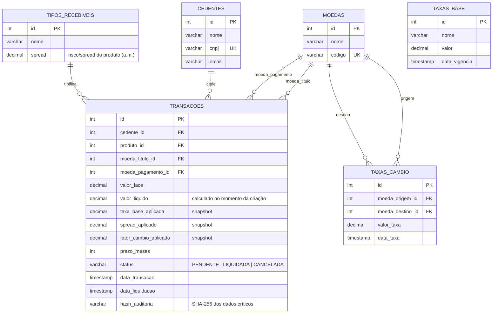

# Diagrama ER — SRM Credit Engine

Modelo relacional normalizado (3FN). Script DDL completo com constraints, índices e seed de dados em [`bd/schema.sql`](../bd/schema.sql).

## Decisões de modelagem

- **Snapshot de taxas na transação** (`taxa_base_aplicada`, `spread_aplicado`, `fator_cambio_aplicado`): a transação registra as taxas vigentes no momento da criação, não uma referência viva a `tb_taxas_base`/`tb_taxas_cambio`. Isso garante que uma transação liquidada não mude de valor retroativamente se a taxa base ou o câmbio forem atualizados depois — requisito de auditabilidade financeira.
- **`hash_auditoria`**: hash SHA-256 dos dados críticos da transação (cedente, valores, taxas aplicadas, prazo), gerado em `AuditoriaService`. Permite detectar divergência/adulteração dos dados após a persistência.
- **`status` como máquina de estados simples**: `PENDENTE → LIQUIDADA` via `PATCH /transacoes/:id/liquidar`, protegido por lock pessimista (`SELECT ... FOR UPDATE`) dentro de uma transação ACID para evitar liquidação em duplicidade sob concorrência. `CANCELADA` está modelado no schema para evolução futura, mas não há fluxo de cancelamento implementado nesta entrega (fora do escopo Pleno).
- **Índices**: `idx_transacoes_extrato` (composto por `data_transacao`, `moeda_pagamento_id`, `cedente_id`) foi desenhado especificamente para o padrão de consulta do endpoint de Extrato (filtro por período + moeda + cedente).
